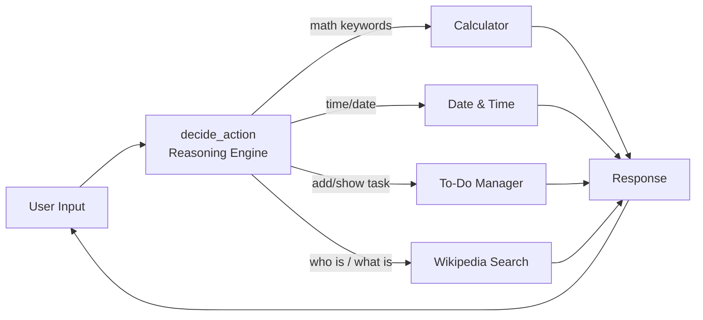
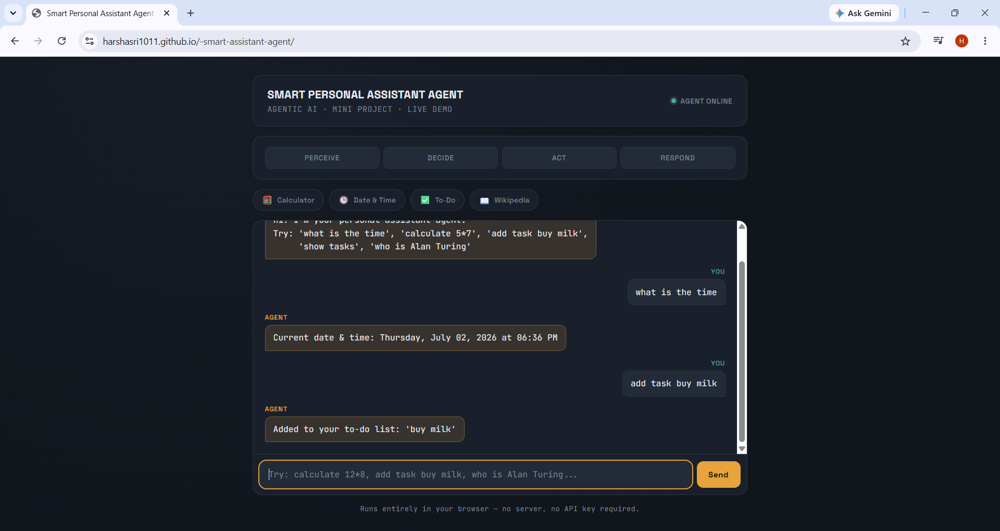

# 🤖 Smart Personal Assistant Agent

A beginner-level **Agentic AI** mini project built in Python. Instead of doing one fixed task, this agent autonomously decides *which tool to use* based on what you type — the same Perceive → Decide → Act → Respond loop that powers modern AI assistants.

---

## 📌 Features / Tools

| Tool | What it does | Example input |
|---|---|---|
| 🧮 Calculator | Solves basic math expressions | `calculate 25*4` |
| 🕒 Date & Time | Returns the current date/time | `what is the time` |
| ✅ To-Do Manager | Adds / views tasks | `add task buy milk`, `show tasks` |
| 📖 Wikipedia Search | Looks up a topic and summarizes it | `who is Alan Turing` |

The agent doesn't run all four every time — it **reasons about your request first**, then picks the right one. That decision-making step is what makes it "agentic" rather than a plain script.

---

## 🧠 How It Works



1. **Perceive** — the agent reads the raw text you type
2. **Decide** — `decide_action()` looks at keywords/intent and picks a tool
3. **Act** — the chosen tool function runs
4. **Respond** — the result is printed, and the loop waits for your next input

---

## 🌐 Live Demo

**[➡️ Open the live web app HERE](your-github-pages-link-goes-here)**

A browser-based version (`index.html`) visualizes the agent's Perceive → Decide → Act → Respond pipeline live as you chat with it. Runs entirely client-side — no server, no API key.

## 🎥 Demo



```text
You: what is the time
Agent: Current date & time: Saturday, 27 June 2026, 02:00 PM

You: add task submit project report
Agent: Added to your to-do list: 'submit project report'

You: show tasks
Agent: Your tasks:
1. submit project report

You: calculate 25*4
Agent: Result: 100

You: exit
Agent: Goodbye!
```

---

## 🛠️ Tech Stack

- **Language**: Python 3
- **Library**: [`wikipedia`](https://pypi.org/project/wikipedia/) (for the search tool)
- **Built-in modules**: `datetime`, `re`

---

## ▶️ How to Run

### Option 1 — Google Colab (easiest, no install)
1. Open [colab.research.google.com](https://colab.research.google.com) → New notebook
2. Run: `!pip install wikipedia`
3. Paste the contents of `agent.py` into the next cell and run it
4. Type your requests in the `You:` prompt that appears

### Option 2 — Run locally
```bash
pip install wikipedia
python agent.py
```

---

## 📂 Project Structure

```
├── index.html                                   # live web interface (deploy via GitHub Pages)
├── agent.py                                    # main source code
├── Untitled2.ipynb                             # Colab notebook (working demo)
├── Smart_Personal_Assistant_Agent_Report.docx  # full mini project report
├── Screenshot_2026-06-27_140014.png             # demo screenshot
└── README.md                                   # this file
```

---

## ⚠️ Limitations

- Uses keyword matching, not true natural-language understanding
- Can't handle complex or multi-step requests
- To-do list is stored only in memory (resets each run)

## 🚀 Future Scope

- Swap the keyword-based decision engine for an LLM (e.g. Google Gemini) so it understands free-form language
- Add voice input/output
- Save the to-do list to a file or database
- Add more tools — weather, email, calendar

---

## 👤 Author

**[Your Name]**
[Your College Name] — [Course/Department]
Mini Project, [Academic Year]
